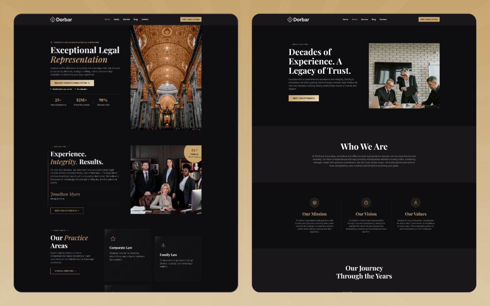

# Dorbar — Professional Dark Law Firm Astro Template

A premium, fully responsive law firm website template built with **Astro 6**. Features **36 static pages**, GSAP scroll animations, a complete blog system, case studies, and a sophisticated dark design with gold accents — perfect for law firms, attorneys, and legal professionals.



## Features

- **36 Pre-built Pages** — Homepage, About, Attorneys, Services (9 detail pages), Blog (8 posts, 4 categories), Case Studies (3), Consultation, Contact, and utility pages
- **Dark Theme** — Professional dark color scheme (#191719) with elegant gold (#c5a46e) accents
- **Fully Responsive** — 5 breakpoints (479px, 767px, 991px, 1280px, 1440px) for pixel-perfect display on all devices
- **SEO Optimized** — Meta tags, Open Graph, Twitter Cards, Schema.org (Attorney, BlogPosting, LegalService), XML sitemap, robots.txt, canonical URLs
- **Accessible** — Skip navigation link, ARIA attributes, focus-visible styles, semantic HTML
- **GSAP Animations** — Scroll-triggered reveals, staggered cards, smooth FAQ accordion, count-up statistics, button glow effects
- **Swiper.js Sliders** — Testimonial carousel and mobile blog slider
- **Dynamic Routes** — `services/[slug]`, `blog-post/[slug]`, `blog-categories/[slug]`, `case-study/[slug]`
- **TypeScript** — Strict mode enabled throughout
- **No jQuery** — Pure vanilla JS with GSAP for all interactions
- **Google Fonts** — Inter (body) + Playfair Display (headings)

## Pages Included

### Main Pages
- Homepage
- About
- Attorneys
- Services
- Blog
- Consultation
- Contact

### Detail Pages
- 9 Service Detail Pages (`/services/[slug]`)
- 8 Blog Post Pages (`/blog-post/[slug]`)
- 4 Blog Category Pages (`/blog-categories/[slug]`)
- 3 Case Study Pages (`/case-study/[slug]`)

### Utility Pages
- Style Guide
- Changelog
- Licenses
- 404 Error Page
- 401 Password Page

## Tech Stack

| Technology | Version | Purpose |
|------------|---------|---------|
| [Astro](https://astro.build) | 6 | Static site framework |
| [GSAP](https://gsap.com) | 3 | Scroll animations & interactions |
| [Swiper](https://swiperjs.com) | 12 | Touch sliders & carousels |
| [Google Fonts](https://fonts.google.com) | — | Inter + Playfair Display |

## Quick Start

```bash
# Clone the repository
git clone https://github.com/your-username/dorbar.git

# Navigate to project
cd dorbar

# Install dependencies
npm install

# Start development server
npm run dev
```

Open [http://localhost:4321](http://localhost:4321) in your browser.

## Commands

| Command | Action |
|---------|--------|
| `npm install` | Install dependencies |
| `npm run dev` | Start dev server at `localhost:4321` |
| `npm run build` | Build production site to `./dist/` |
| `npm run preview` | Preview production build locally |

## Project Structure

```
src/
├── layouts/
│   ├── BaseLayout.astro           # HTML shell, <head>, fonts, GSAP, global.css
│   └── PageLayout.astro           # BaseLayout + Navbar + Footer wrapper
├── components/
│   ├── Navbar.astro               # Desktop + mobile navigation
│   ├── Footer.astro               # 4-column footer with newsletter
│   ├── ui/                        # Buttons, headings
│   ├── cards/                     # Service, testimonial, track record cards
│   ├── icons/                     # Arrow, phone SVG components
│   └── sections/                  # 64 section components
├── data/                          # 15 TypeScript data files
├── pages/                         # All routes (static + dynamic)
├── styles/
│   └── global.css                 # All styles with CSS custom properties
└── utils/
    └── resolveImage.ts            # Image path resolver
```

## Customization

### Site Info

Edit `src/data/siteConfig.ts` to update your firm details:

```ts
export const siteConfig = {
  name: "Dorbar & Associates",
  phone: "+1-555-123-4567",
  email: "info@example.com",
  address: "123 Legal Plaza, Suite 1000, New York, NY 10001",
  social: {
    linkedin: "https://linkedin.com",
    facebook: "https://facebook.com",
    instagram: "https://instagram.com",
  },
};
```

### Colors

All design tokens are CSS custom properties in `src/styles/global.css`:

```css
:root {
  --color-primary: #c5a46e;       /* Gold accent */
  --color-bg: #191719;             /* Dark background */
  --color-dark: #0e0e10;           /* Darker shade */
  --color-white: #ffffff;           /* White */
  --color-white-06: #ffffff99;      /* White 60% */
  --color-gray: #8c8c8e;           /* Gray text */
}
```

### Fonts

The template uses two Google Fonts loaded in `BaseLayout.astro`:

```css
:root {
  --font-heading: 'Playfair Display', sans-serif;
  --font-body: 'Inter', sans-serif;
}
```

### Content

All page content is managed through TypeScript data files in `src/data/`:

| File | Content |
|------|---------|
| `siteConfig.ts` | Firm name, contact info, social URLs |
| `services.ts` | Practice areas listing |
| `serviceDetails.ts` | 9 service detail pages |
| `blogPosts.ts` | 8 blog posts + 4 categories |
| `attorneys.ts` | 6 attorney profiles |
| `testimonials.ts` | Client testimonials |
| `caseStudyDetails.ts` | 3 case study detail pages |
| `pricingPlans.ts` | Consultation pricing plans |

### Adding Pages

1. Create a new `.astro` file in `src/pages/`
2. Import `PageLayout` and wrap your content:

```astro
---
import PageLayout from '../layouts/PageLayout.astro';
---

<PageLayout title="Page Title" description="Page description">
  <!-- Your sections here -->
</PageLayout>
```

3. For dynamic routes, export `getStaticPaths()`:

```astro
---
export const getStaticPaths = () => {
  return data.map((item) => ({
    params: { slug: item.slug },
    props: { item },
  }));
};
---
```

## Browser Support

| Browser | Support |
|---------|---------|
| Chrome | Latest |
| Firefox | Latest |
| Safari | Latest |
| Edge | Latest |

## License

This project is licensed under the MIT License — see the [LICENSE](LICENSE) file for details.

## Author

**Hasthemes**

---

Built with [Astro](https://astro.build) 🚀
